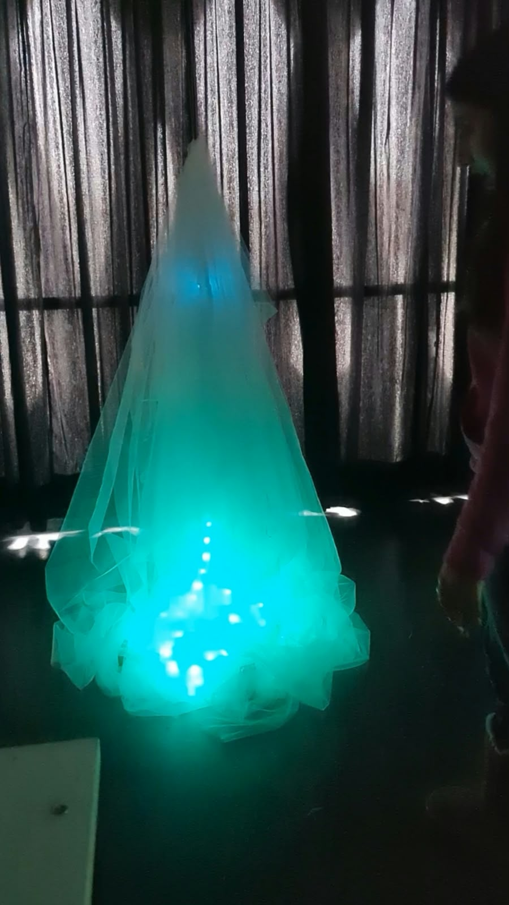
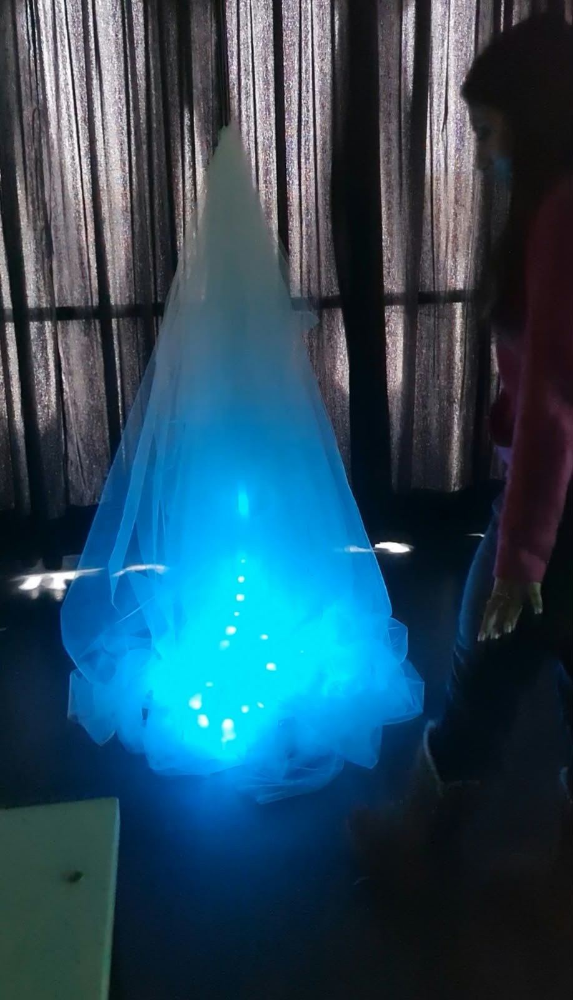
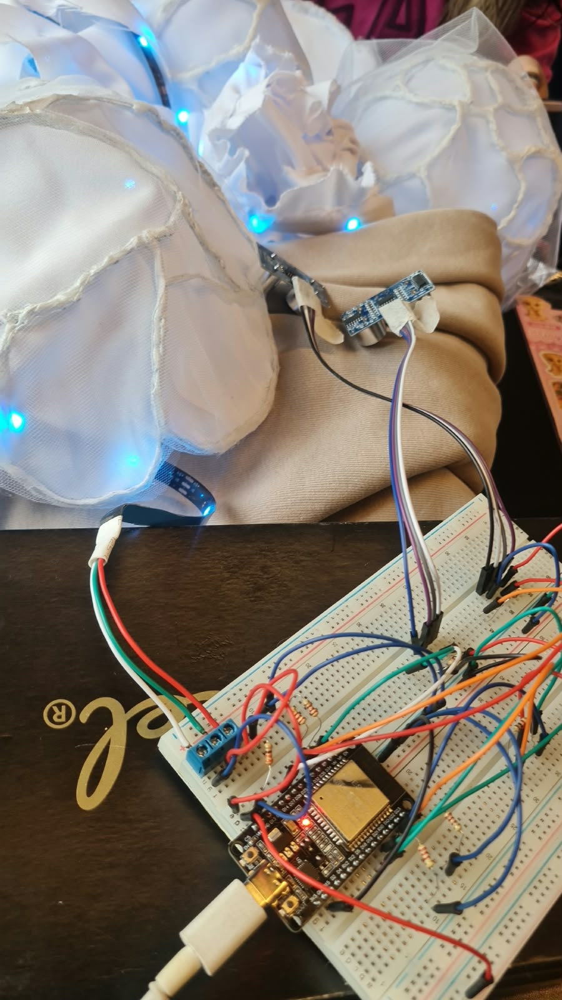
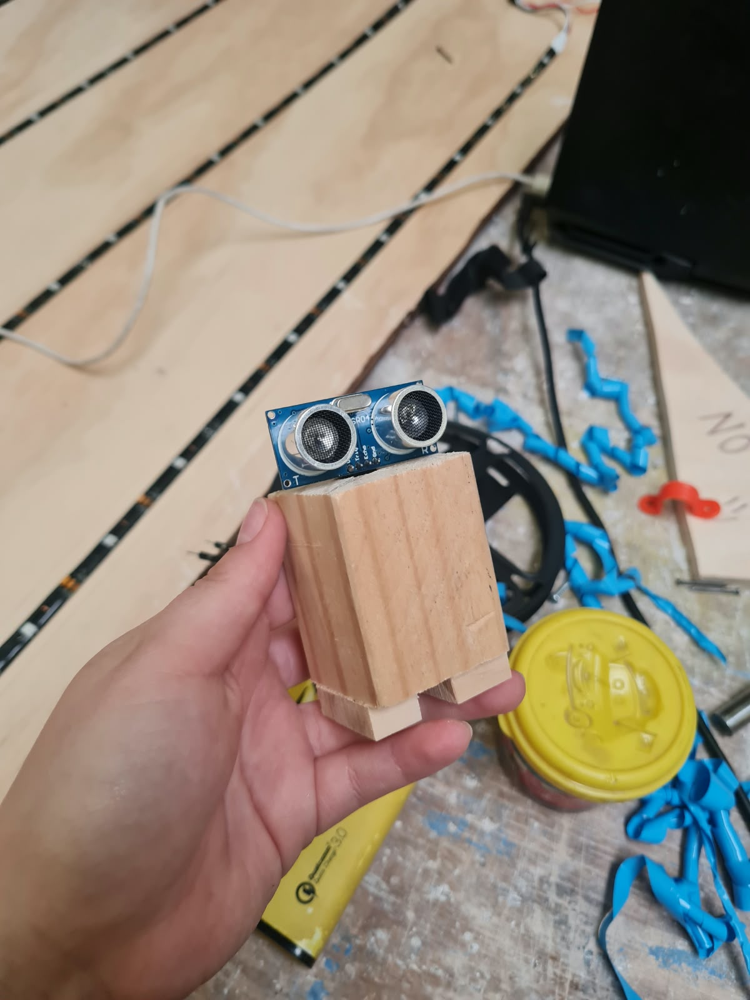

# Clase 11 — 24/09/2026

## Corrección del proyecto: Umbral

### 1. Estado del proyecto

Para esta clase presentamos un prototipo de instalación interactiva de aproximadamente **1,50 m de altura y 60 cm de diámetro**. La estructura está compuesta por cúpulas inspiradas en las texturas del hongo, de las cuales se desprende una tela de tul sostenida mediante hilos de pescar, generando una sensación de ligereza y flotación.

El objeto reacciona a la proximidad de las personas mediante cuatro sensores ultrasónicos y una tira de 90 LED, cuya iluminación cambia según la distancia detectada.

### 2. Funcionamiento e interacción

La programación se desarrolló en Arduino IDE para controlar los sensores ultrasónicos y la tira LED mediante un ESP32.

El sistema utiliza la distancia más cercana detectada por los cuatro sensores para modificar la iluminación, generando distintos comportamientos:

* **Más de 100 cm:** respiración agitada en tonos turquesa y verde.
* **Entre 80 y 100 cm:** respiración más acelerada.
* **Entre 60 y 80 cm:** recorrido de un LED turquesa a lo largo de la tira.
* **Entre 40 y 60 cm:** respiración constante combinada con un recorrido de luz.
* **Entre 0 y 40 cm:** iluminación verde con una variación progresiva de intensidad.

### 3. Corrección y retroalimentación

Durante la corrección, los profesores nos indicaron que debíamos mejorar principalmente la presentación del proyecto. Reconocemos que no aprovechamos completamente esta instancia, ya que concentramos gran parte de nuestro esfuerzo en el desarrollo del objeto y el circuito.

Respecto a la estructura, nos recomendaron mantener la propuesta actual como base, pero **perfeccionar el montaje y la integración de sus componentes**, especialmente la relación entre la tira LED y el objeto, ya que todavía se percibe demasiado separada de la estructura.

En cuanto a la programación, nos señalaron la necesidad de pulir las transiciones entre los efectos de iluminación. Actualmente, cuando una persona se acerca demasiado rápido, el sistema puede trabarse, afectando la continuidad de la interacción.

### 4. Aspectos por mejorar

* **Montaje:** integrar mejor la tira LED a la estructura para que ambos elementos se perciban como una sola unidad.
* **Materialidad:** perfeccionar los acabados y la disposición del tul y los elementos que lo sostienen.
* **Programación:** optimizar la respuesta de los sensores y evitar bloqueos cuando las personas se acercan rápidamente.
* **Presentación:** mejorar la manera en que comunicamos el concepto, el funcionamiento y las decisiones formales del proyecto.

### 5. Imágenes de este día 

  
  
   
  

